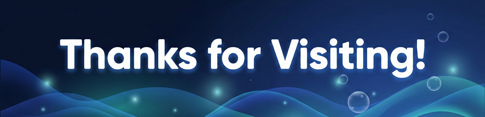

  

🎓 1st-Year B.S. Student @ IIT Jodhpur  
💡 Curious Mind · 👨‍💻 Tech Explorer · 📊 Future Data Scientist  

  
  
  
  

---

### 🧠 About Me

Hi! I'm **Daksh**, a first-year student at **IIT Jodhpur** who loves turning ideas into small but meaningful projects.  
Right now I'm exploring how **AI, data, and code** can be used to solve real-world problems.

- 🎯 **Goal:** Become a *Data Scientist*
- 🧩 **Interests:** AI, Data Science, Machine Learning, Analytics
- 🧪 **Currently learning:** Python, EDA, Statistics, AI tools, and practical ML workflows
- 🌱 **Mindset:** Start small, iterate fast, document everything

---

### 🚀 My Learning Projects

| 📂 Project | 🔗 Links | 🛠️ Highlights |
|-----------|----------|---------------|
| **Flashcards Quiz App** | [Live](https://flashcards-quiz-rouge.vercel.app/) · [Repo](https://github.com/dk-khandelwal06/Flashcards-Quiz) | Built with Cursor.ai · Flip-based UI · ML Basics Revision |
| **Portfolio Website** | [Live](https://portfolio-website-sepia-one-78.vercel.app/) · [Repo](https://github.com/dk-khandelwal06/Portfolio-Website) | Personal branding · Cursor-generated UI |
| **The Quick Commerce Conundrum** | [Report](https://drive.google.com/file/d/1YYxyXE_H4Hdnl21lmaB8qrUtDi3aHQdO/view?usp=sharing) · [Repo](https://github.com/dk-khandelwal06/The-Quick-Commerce-Conundrum-Report) | Data Analysis Project · Hypothesis · Visualizations · Insights |

---

### 🛠️ Tools I’m Exploring

  
  
  
  
  

  
  
  

---

### 🎯 2026 Goals

- ✅ Complete **5+ hands-on AI/Data Science projects**
- 🧠 Publish **mini blogs** about what I build and learn
- 🤝 Start contributing to **beginner-friendly open source**
- 🌐 Build a consistent **LinkedIn + GitHub presence**

---

## 📊 GitHub Stats

  
  

  

---

### 📬 Get In Touch

  
  
  

---

<h3 align="center"><em>💡 “Learning by building — one project at a time.”</em></h3>

---

  

  <!-- Followers auto-update -->
  

  <!-- Profile Views auto-update -->
  

